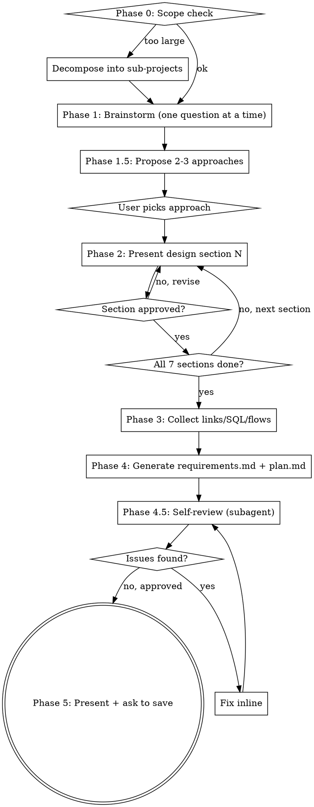

# gen-dev-docs

Generate `requirements.md` + `plan.md` matching **exactly** the Oshiete-AI/dev-docs format.
Walks the user from a rough user-story to an approved design through a gated dialogue,
then emits the two doc files.

## References
- `references/scope-check.md` — Phase 0 decomposition heuristics
- `references/brainstorm-phase.md` — dialogue rules, approaches template, section-by-section approval
- `references/requirements-template.md` — full requirements.md template
- `references/plan-template.md` — full plan.md template (Design + Implementation Plan)
- `references/format-rules.md` — strict format rules
- `references/plan-self-review.md` — subagent dispatch template for doc review

## Workflow



<HARD-GATE>
Do NOT generate any docs (Phase 4) until ALL 7 design sections are approved by the user
in Phase 2. This applies regardless of how "simple" the feature seems.
</HARD-GATE>

---

### Phase 0 — Scope Check

Before any questions, assess whether the feature fits a single spec.
Read `references/scope-check.md` for decomposition signals and the proposal template.

- Multiple independent subsystems / actor groups / external integrations → **decompose**, agree on the first sub-project, then proceed.
- Otherwise → proceed to Phase 1 with the full feature.

---

### Phase 1 — Brainstorm (one question at a time)

Read `references/brainstorm-phase.md` for:
- Dialogue rules (agent-driven, ONE question at a time)
- Rules (YAGNI, multiple-choice preferred, no bundling)

Stop asking when you have enough to propose 2-3 approaches.

---

### Phase 1.5 — Propose 2-3 Approaches

Before presenting the design, propose 2-3 **genuinely different** approaches with tradeoffs.
See `references/brainstorm-phase.md` → "Approach Proposal" section for the template.

- Lead with the recommended option + reasoning
- Wait for user to pick one before moving on

If only one viable approach really exists, say so explicitly and explain why.

---

### Phase 2 — Section-by-section Design Approval [HARD-GATE]

Present the design in **7 sections, one section per message**. Wait for explicit approval
after each section before moving on. See `references/brainstorm-phase.md` → "Section-by-section
Approval" for the section list and per-section template.

Never bundle two sections. Skip optional sections explicitly (e.g. "DB changes: none").

---

### Phase 3 — Collect Technical Details

Only after all 7 sections approved, ask for links/SQL/flows in one message.
See `references/brainstorm-phase.md` → "After Approval" section.

---

### Phase 4 — Generate Docs

Generate both files using templates in `references/`.
Follow ALL rules in `references/format-rules.md`.

---

### Phase 4.5 — Plan Self-Review

Before presenting to user, dispatch a subagent to review the generated docs.
See `references/plan-self-review.md` for dispatch template and fix rules.

- Issues found → fix inline, re-review once max
- Approved → proceed to Phase 5

---

### Phase 5 — Present & Save

Show output paths:
```
features/{feature-kebab-case}/requirements.md
features/{feature-kebab-case}/plan.md
```
Then ask: "Save to the `dev-docs` repository?"
